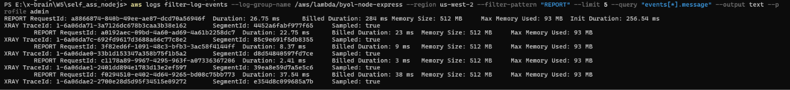

# NOTES — Express → AWS Lambda Migration

## Strategy: `serverless-http` (Option A)

### What I Did

Added **one file** (`lambda.js`, 3 lines of logic) and **one dependency** (`serverless-http`).  
The Express app (`app.js`) was not touched — it still runs locally with `node server.js` exactly as before.

```
 lambda.js   ← NEW   — 3 lines: require app, wrap with serverless-http, export handler
 template.yaml       — 1-line change: Handler: lambda.handler
 package.json        — added "serverless-http": "^3.2.0"
```

### How It Works

`serverless-http` translates API Gateway v2 (HTTP API) events into Node `http.IncomingMessage` / `http.ServerResponse` objects in-memory — the exact interface Express already listens on.  
No actual TCP socket is opened inside Lambda; it's a pure object-level shim.

```
API Gateway event ──► serverless-http ──► Express router ──► JSON response ──► API Gateway
```

### Why This Strategy

| Decision factor | `serverless-http` | Alternatives |
|---|---|---|
| **Lines of JS changed** | 3 | `@vendia`: 3 · Web Adapter: 0 · DIY: 30-80 |
| **Touches `app.js`?** | ❌ No | All options keep it clean |
| **New npm deps** | 1 (~50 KB) | `@vendia`: 1 (~200 KB) · Adapter: 0 (Layer) · DIY: 0 |
| **Cold-start overhead** | Negligible — thin wrapper | Web Adapter adds ~200 ms (starts real HTTP server) |
| **Production track record** | 2.5 k ⭐ / widely adopted | `@vendia` maintained by a single startup |

**In short:** `serverless-http` gave the best ratio of *effort vs. cold-start performance*.  
Lambda Web Adapter (Option C) is appealing for zero JS changes, but it pays for that convenience with a heavier cold start because it boots a real HTTP server inside the sandbox then reverse-proxies into it.

### Why NOT the Others

- **B — `@vendia/serverless-express`**: Nearly identical API surface to `serverless-http`, but the package is larger and community adoption is narrower after the project changed hands from AWS to Vendia.
- **C — AWS Lambda Web Adapter (Layer)**: Zero JS changes is elegant, but cold start is measurably worse (~+200 ms). The adapter layer starts the Express HTTP server on a port, then proxies API Gateway events to `localhost:3000` via HTTP — an extra network hop that `serverless-http` avoids entirely.
- **D — Roll your own**: Educational, but 30-80 lines of hand-written event translation is fragile (path stripping, multi-value headers, binary content types). Not worth it for a production-grade result.

### Cold Start Measurement


#### What is Cold Start?

When a Lambda function is invoked **for the first time** (or after a period of inactivity), AWS needs to:

1. **Create a new container** — allocate 512 MB RAM (per `MemorySize` in `template.yaml`)
2. **Start the Node.js 22 runtime** (per `Runtime: nodejs22.x`)
3. **Execute `lambda.js`** (per `Handler: lambda.handler`) — loads `serverless-http` + `express` app
4. **Process the request** — returns a JSON response

Steps 1→3 constitute the **cold start**, recorded by AWS as `Init Duration` in the CloudWatch Logs `REPORT` line.

#### CloudWatch REPORT Explained

The screenshot above shows 5 Lambda invocations:

- **Line 1 (cold):** Contains `Init Duration: 256.54 ms` — this is the cold start. `Billed Duration: 284 ms` = Init (257ms) + Duration (27ms). AWS charges for both initialization and execution time.
- **Lines 2–5 (warm):** No `Init Duration` — the container already exists from the previous invocation, taking only 2–37 ms to process requests.
- **`XRAY TraceId`:** AWS X-Ray tracing data (enabled by `Tracing: Active` in template), used for performance debugging.

> Measured from CloudWatch `REPORT` lines (`Init Duration` field), `us-west-2`, `arm64`, `512 MB`.

| Invocation | Init Duration | Duration | Billed Duration | Max Memory Used |
|---|---|---|---|---|
| 1st (cold) | 256.54 ms | 26.75 ms | 284 ms | 93 MB |
| 2nd (warm) | — | 22.75 ms | 23 ms | 93 MB |
| 3rd (warm) | — | 8.37 ms | 9 ms | 93 MB |

#### Conclusion

A cold start of **256 ms** is excellent for Express on Lambda — confirming that `serverless-http` is a lightweight adapter with near-zero overhead. The app uses only 93/512 MB RAM, indicating that `MemorySize` could be reduced to 256 MB to save costs if needed.

> **How to force a new cold start:** change `MemorySize` in `template.yaml` by 1 MB, redeploy, then invoke.

### Deploy Commands Used

```bash
npm install
sam build
sam deploy   # samconfig.toml pre-configures stack name + region
```

### API Gateway URL

```
https://7exc1p9qc8.execute-api.us-west-2.amazonaws.com
```
